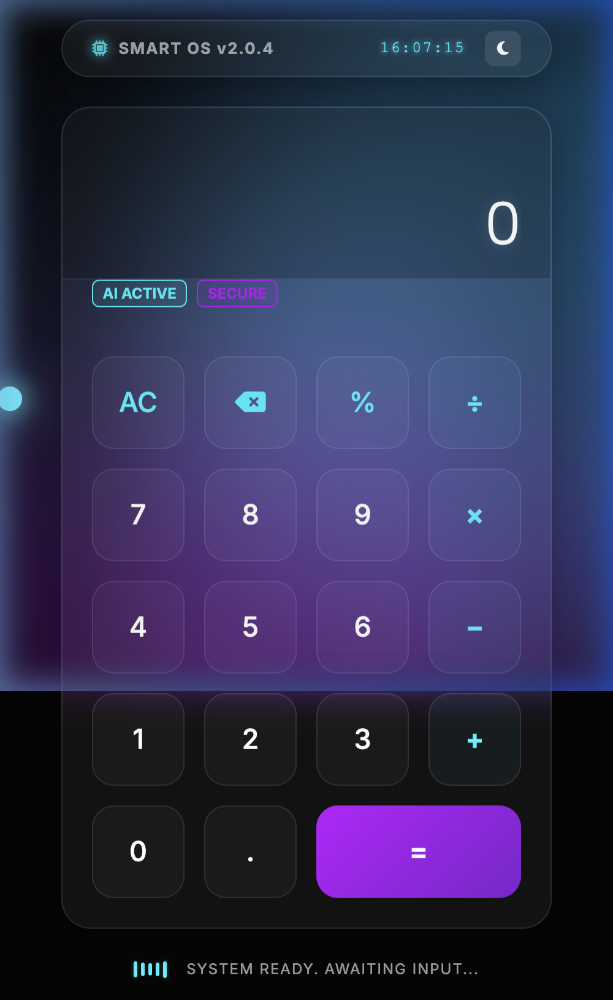

# Smart Glass | Futuristic Calculator

A premium, high-end futuristic calculator web application built with a "Smart Glass Device" aesthetic. This project features advanced CSS effects, smooth animations, and a sophisticated glassmorphism design.

## ✨ Key Features

- **Glassmorphism UI**: Frosted glass panels with `backdrop-filter` and semi-transparent layers.
- **Neon Aesthetics**: Cyberpunk-inspired neon glows and vibrant accent colors.
- **Animated Background**: Dynamic CSS blobs and a dark, modern gradient background.
- **Smart Interactions**: Custom cursor glow, button ripple effects, and haptic-style scaling.
- **Smart OS Interface**: Digital clock, system status indicators, and an AI-themed status bar.
- **Responsive Design**: Fully optimized for mobile, tablet, and desktop viewing.
- **Keyboard Support**: Complete desktop experience with keyboard shortcuts.

## 🛠 Tech Stack

- **HTML5**: Semantic structure.
- **CSS3**: Custom glassmorphism design system, Keyframe animations, Flexbox/Grid.
- **JavaScript**: Vanilla ES6+ logic engine.
- **Bootstrap 5**: Layout and responsive grid support.
- **Google Fonts**: Inter & Poppins.
- **Font Awesome**: Premium vector icons.

## 🚀 Live Repository

You can find the source code and track updates here: [GitHub Repository](https://github.com/BallariVinuthna/Alfido_calculator)

## 🚀 Getting Started

Simply open `index.html` in any modern web browser to experience the Smart Glass Calculator.

## 🎹 Keyboard Shortcuts

- `0-9`: Numbers
- `+`, `-`, `*`, `/`: Operators
- `Enter` or `=`: Calculate
- `Backspace`: Delete last input
- `Esc`: Clear all (AC)
- `.`: Decimal
- `%`: Percentage

---

